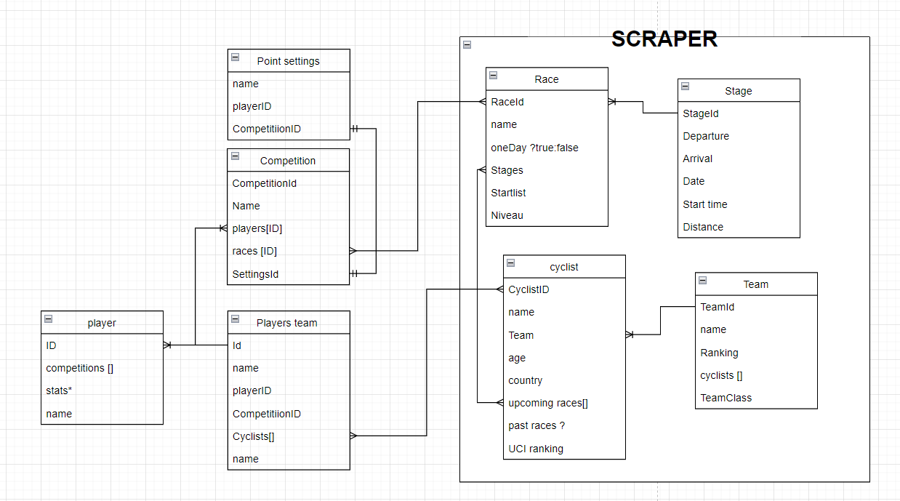

# ProCycling manager - Documentatie

Dit is een Java Spring Boot applicatie. Deze applicatie dient voor het maken van wielerploegen en competities onder vrienden.
We halen de data op via het scrapen van de website https://www.procyclingstats.com/index.php.

---
# Opstart

### Stap 1 Installatie nodige software
Voor maven installatie heb je ook een package installer nodig op je pc zoals: 

Mac: Homebrew
Linux: APT
Windows: Chocolatey 

Dit is nodig zodat hij maven kan installeren.
Maven: https://maven.apache.org/install.html

Java: https://www.java.com/en/download/manual.jsp 


### Stap 1 Installatie van het project
Ga naar de github waarbij je het kan installeren. 
Op de groene knop "Code" kan je drukken en vanonder staat Download zip. Download dit naar een correcte locatie die je weet staan. 

### Stap 2 zip uitpakken
Klik met rechter muisknop op de net geinstalleerde zip folder en selecteer alles uitpakken. 

### Stap 3 Open terminal voor project 
Open de folder waar je ht project hebt staan. Het einde van het pad zou moeten overeen komen met `\CyclingManager`

Als je in de folder zit kan je rechtermuisknop duwen en naar en de optie open new terminal selecteren. Als je dit hebt gedaan krijg je een zwarte box met dit in in de test voor het pijltje `\CyclingManager>`

### Stap 4 installatie van project 
Voor het opstarten moet je deze commando's uitvoeren in de folder: `\CyclingManager` 

Voer commando per commando uit. 

```sh
mvn clean install
```
```sh
mvn compile
```
```sh
mvn spring-boot:run
```

### Stap 5 
Gebruik de gegeven data in postman. Meer info hoe dit moet kan je hier vinden [Postman](#Postman)

---
## Structuur
Hierbij zal er meer uitleg volgen per model, service, repository en controller zoals alles van cyclist bijvoorbeeld. Wat dit allemaal is wordt meer uitgelegd per item. Ook hier een relationeel model van onze database met de verschillende fields.


**********************

### `Models`
Dit zijn de modellen van elke entiteit die we gebruiken in de applicatie.
We gebruiken hier verschillende annotaties voor het vereenvoudigen van het gebruik.
Meer info vindt je hier: [Annotaties](#annotaties)

Voor de relaties tussen verschillende tabellen te legegn gebruiken we ook specieke code zodat we data kunnen connecteren. Lees hier extra info over de relaties: [Relations](#relations)


#### `Cyclist`
Vertegenwoordigt een professionele wielrenner. Hierbij kunnen we de verschillende fields kiezen die beschikbaar zijn. 

Ook wordt ze de relatie gelegd met Races via de field upcoming races(work in progres)


`````java
    @Id
    @GeneratedValue(strategy = GenerationType.IDENTITY)
    private Long id;

    String name;
    int ranking;
    int age;
    String country;
    String teamName;

    @ManyToMany(mappedBy = "startList")
        private List<Race> upcomingRaces;
`````

#### `Team`
Vertegenwoordigt een wielerploeg met bijbehorende renners.
Hiervoor is er ook een one-to-many relatie gelegd met de cyclist. Dus 1 ploeg kan meerdere renners hebben.

`````java
    @Id
    @GeneratedValue(strategy = GenerationType.IDENTITY)
    private Long id;

    private String name;
    private int ranking;
    @OneToMany(mappedBy = "id")
    private List<Cyclist> cyclists;
    private String teamUrl;
`````

#### `Race`
Vertegenwoordigt een Race zoals Tour de France. Hierbij worden verschillende relaties opgeslagen. 

One-To-Many race-> stages: Een race kan meerdere stages bevatten zoals in de Tour De France zijn er 21 stages. 

Many-To-Many races-> cyclists: dit is voor de startlijst van renners per race te kunnnen opslagen (work in progress)

`````java
    @Id
    @GeneratedValue(strategy = GenerationType.IDENTITY)
    private Long id;
    private String name;
    private String niveau;
    private String startDate;
    private String endDate;
    private Integer distance;
    private String raceUrl;

    @OneToMany(cascade = CascadeType.ALL)
    @JoinColumn(name = "race_id")
    private List<Stage> stages;

    @ManyToMany
    @JoinTable(
        name = "race_cyclist",
        joinColumns = @JoinColumn(name = "race_id"),
        inverseJoinColumns = @JoinColumn(name = "cyclist_id")
    )
    private List<Cyclist> startList;
`````
#### `Stage`
Vertegenwoordigt een Stage van een race. Hierbij zijn geen relaties zelf in vastgelegd aangezien dit al gedaan wordt in de race zelf. 

`````java
    @Id
    @GeneratedValue(strategy = GenerationType.IDENTITY)
    private Long id;
    private String name;
    private String departure;
    private String arrival;
    private String date;
    private String startTime;
    private Integer distance;
    private String stageUrl;
    private Integer verticalMeters;
`````
---

#### `CyclistService`
#### scrapeCyclists
- Scrape van de wielrenners data van een team-pagina.
#### scrapeCyclistDetails
- Extract gegevens zoals naam, leeftijd, ranking en land.
##### extractAge
- Extract age from String: "Date of birth: 12th November 2002 (22)"
##### getUciRanking
- Get het correcte element voor de UCI ranking.
  - Dit moet aangezien de UCI ranking kan verplaatsen van plaats per renner. Dit door de PCS ranking en all-time ranking en het hangt af van social media iconen erboven.


#### `TeamService`
#### Scrape
- Scrape van de topteams van ProCyclingStats.
- Slaat teams op met hun URL en ranking.

#### `RaceService`
#### scrapeRaces
- Scrape van de race data van een race-pagina.

#### `StageService`
#### scrapeStages
- Scrape van de stages data van een race-pagina.
#### isStagesTable
- controleert op correcte tabel
##### scrapeStageDetails
- Scrape voor details van een stage zoals: start time, Distance, vertical meters, Departure, Arrival

---


---

### `Repository`
JPA Repositories voor uitvoering van de data die we in de database kunnen vinden. Hierbij zijn verschillende functionaliteiten standaard beschikbaar en moeten we deze niet meer aanmaken. Bijvoorbeeld een findAll of findByValue.
Door dit is het meestal ook leeg buiten de eerste lijn.
#### CyclistRepository
- `CyclistRepository extends JpaRepository<Cyclist, String>`
#### TeamRepository
- `TeamRepository extends JpaRepository<Team, String>`
#### RaceRepository
- `RaceRepository extends JpaRepository<Race,Long>`
#### StageRepository
- `StageRepository extends JpaRepository<Stage,Long>`
---

### `Controllers`
Dit zal de API's maken of anders gezegd de links voor de gebruiker om te gebruiken. Ook worden deze links gebruikt met de frontend. 
Hieronder kan u een lijst vinden van alle gebruikte links. 
#### `CyclistController`
- **GET /cyclists** – API definitie voor alle linken met Cyclist. Dit is een basis link waarbij er iets kan worden toegevoegd voor andere links. Het is ook de link voor alles te tonen. 

- **GET /cyclists/scrape** – API definitie voor het scrapen zelf. 

#### `TeamController`
- **GET /teams** – API definitie voor alle linken met Team.
Ook de get all. 
- **GET /teams/scrape** – API defenitie voor het scrapen zelf.

#### `RaceController`
- **GET /reces** – API definitie voor alle linken met Race.
Ook de get all. 
- **GET /races/scrape** – API defenitie voor het scrapen zelf.

#### `RaceController`
- **GET /stages** – API definitie voor alle linken met Stage.
Ook de get all. 
- **GET /stages/scrape** – API defenitie voor het scrapen zelf.
---

## Gebruikte Technologieën

- Spring Boot (Web, JPA)
- Lombok
- Jsoup (HTML parsing)
- PostgreSQL / MySQL (als database)
- REST API met JSON output
- Postman

## PostMan
Dit is een applicatie die kan gebruikt worden maar je kan het ook gewoon uitvoeren in de browser. Dit programma maakt enkel het gebruik fijner. 

Je kan installeren via deze link: 

Als je het hebt geïnstalleerd dan kunnen we de file importeren naar postman.

Je kan in collections normaal gezien in het midden bovenaan een knop vinden import. Als je op deze knop hebt geduwt selecteert u de file : ******* 

Eens dit geimpoteerd is kan je nu via hier de api calls gebruiken. Je selecteert welke je wilt en drukt op send. 
Tip: Vergeet je applicatie niet aan te zetten `:)`
----
# Wat als er data niet meer getoond wordt? 
## Stap 1
Dit is een probleem dat zou kunnen voorkomen. Hierbij eerst gaan kijken bij wat het voorkomt stage, renner of een andere. 

## Stap 2
Als je dit hebt vastgesteld moet je kijken waar dat je data mist. Hiervoor ga je dan in de service van de data en ga je zoeken naar de functie die erbij hoort. 

## Stap 3
Als je de correcte functie hbet gevonden zal er meestal iets staan van een html pad naar de bepaalde data. Hier kan het misschien verschoven zijn en moeten we dit gaan controleren.

## Stap 4
Open procyclingstats en ga naar de link of pagina waarbij er wordt gescraped. Hier een lijst per model welke paginas er worden gebruikt. 
### Team
- `https://www.procyclingstats.com/rankings/me/teams`
- `https://www.procyclingstats.com/fill-in-team-name`
### Cyclist
- `https://www.procyclingstats.com/fill-in-team-name`
- `https://www.procyclingstats.com/fill-in-rider-name`
### Race
- `https://www.procyclingstats.com/races.php?season=2025&month=&category=1&racelevel=2&pracelevel=smallerorequal&racenation=&class=&filter=Filter&p=uci&s=calendar-plus-filters`
- `https://www.procyclingstats.com/fill-in-raceName`

## Stap 5
Als je op de juiste pagina bent geraakt kan je nu gaan zoeken in de html door rechter muisknop te duwen en inspecteren te duwen.

## Stap 6 
Nu ga je naar de tab elements in bovenste balk. Als
### Stage
Stage is getting fetched with the race already
----
### Annotaties:
#### Spring Annotaties:
Dit zorgt ervoor dat het gebruik en creatie van de database makkelijker verloopt.
Hierbij gaan we met @Entity zeggen dat dit een entiteit is die aangemaakt moet worden in de database.
@Id gebruiken we voor het aantonen dat de database dit mag gebruiken als identifier en we zullen het ook automatisch laten genereren aan de hand van @GeneratedValue.
`````java
@Entity
@Id
@GeneratedValue(strategy = GenerationType.IDENTITY)
private Long id;
`````


#### Lombok:
Lombok is een dependency (pakket) dat we gebruiken in onze applicatie. Dit zorgt ervoor dat we basiscode niet steeds opnieuw moeten schrijven.
Het zal dus zelf alle setters en getters maken die er bijvoorbeeld voor zorgen dat je een renner kan inschrijven in de database of ophalen.

Ook hebben we nog:

`````java
@Getter
@Setter
@AllArgsConstructor
@NoArgsConstructor
`````

@Getter en @Setter zorgen automatisch voor het maken van alle getters en setters voor de velden in de klasse.

@AllArgsConstructor Dit zorgt ervoor dat we geen constructor maken. Dit bind alle velden van in de model te samen tot 1 object bijvoorbeeld Cyclist.

@NoArgsConstructor maakt een lege constructor (zonder velden). Deze is bijvoorbeeld nodig als je frameworks zoals JPA gebruikt die een lege constructor nodig heeft.

### Voorbeeld met en zonder lobok

#### Met Lombok:
````Java
import lombok.AllArgsConstructor;
import lombok.Getter;
import lombok.NoArgsConstructor;
import lombok.Setter;

@Getter
@Setter
@NoArgsConstructor
@AllArgsConstructor
public class Person {
    private String name;
    private int age;
}

````

#### Zonder Lombok:
````Java
public class Person {
    private String name;
    private int age;

    public Person() {
    }

    public Person(String name, int age) {
        this.name = name;
        this.age = age;
    }

    public String getName() {
        return name;
    }

    public void setName(String name) {
        this.name = name;
    }

    public int getAge() {
        return age;
    }

    public void setAge(int age) {
        this.age = age;
    }
}

````

### Relations
Hierbij even een korte uitleg van de database relaties die in de code gemaakt worden. Dit is ook een van de grootste rednen waarom we spring boot gebruiken. Spring boot zal veel automatiseren zodat we minder moeten doen. 

#### OneToMany Race-> Stages
Hierbij willen we de connectie tussen race en stages maken waarbij een race meerdere stages kan hebben. 
We gebruiken hier ook cascade zodat als de race wordt verwijdert de stages ook worden verwijdert. 

Ook moeten we zeggen wat hij moet geruiken om de stages te maken. Hierbij gebruiken we de id van race.
```Java
    @OneToMany(cascade = CascadeType.ALL)
    @JoinColumn(name = "race_id")
    private List<Stage> stages;
```

#### ManyToMany Races -> Cyclists
Hierbij zorgen we voor de relatie cyclist kunnen meerdere races hebben en omgekeerd. 
Hiervoor gebruiken we een tussentabel (work in progress)

Race Model
```Java
    @ManyToMany
    @JoinTable(
        name = "race_cyclist",
        joinColumns = @JoinColumn(name = "race_id"),
        inverseJoinColumns = @JoinColumn(name = "cyclist_id")
    )
    private List<Cyclist> startList;

```
Cyclist Model

Hier doen we nog een @JsonBackReference lees hier voor meer info: [JsonBackReference](#JsonBackReference)

```Java
@ManyToMany(mappedBy = "startList")
@JsonBackReference(value = "race-cyclist")
private List<Race> upcomingRaces;
```

## JsonBackReference
Dit zal ervoor zorgen dat er geen loop is in de data. Als je dit niet toepast dan zal je dus een loop creeren. Een voorbeeld hiervan is: Team en cyclist waarbij in een team de cyclists zitten maar in een cyclist ook een team zit. En dan blijft het oz doorgaan tot het oneindige. 

````Java
@JsonBackReference(value = "Tabel")
```


